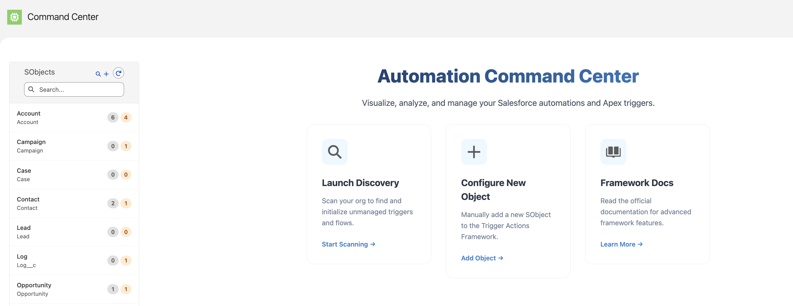
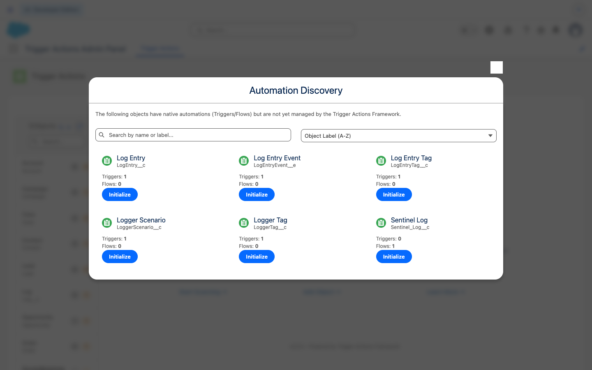
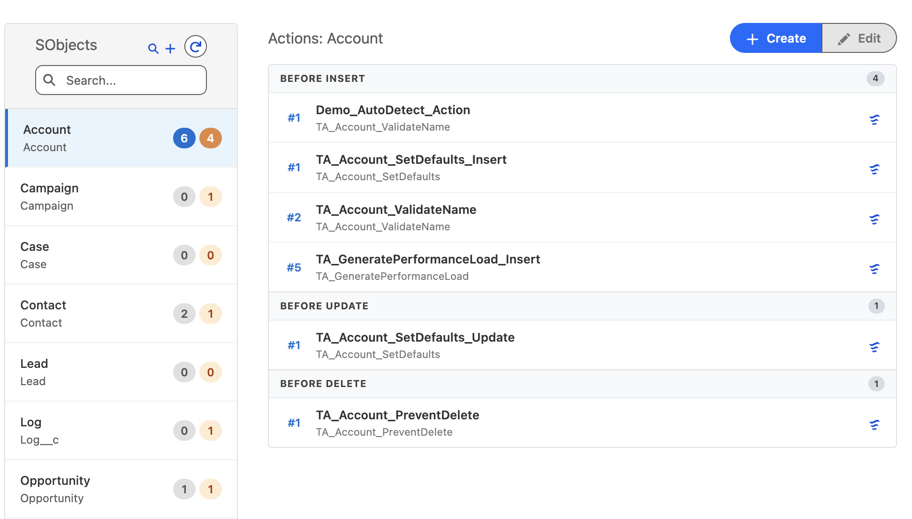
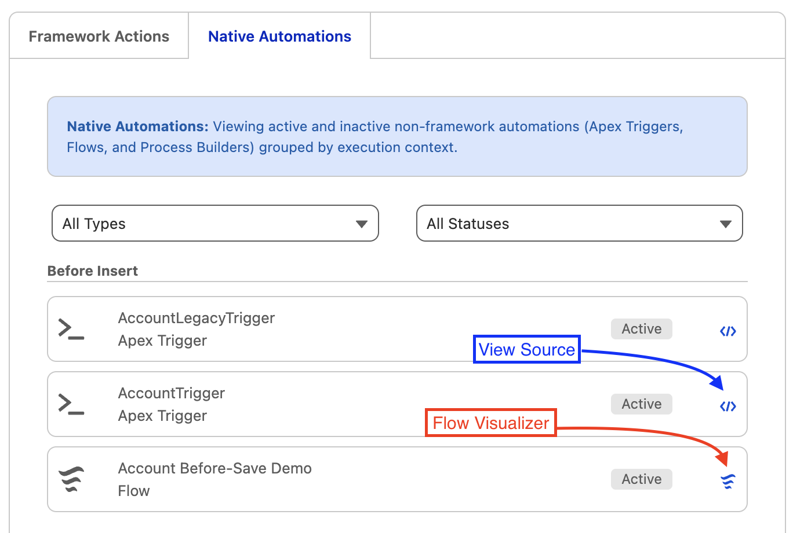
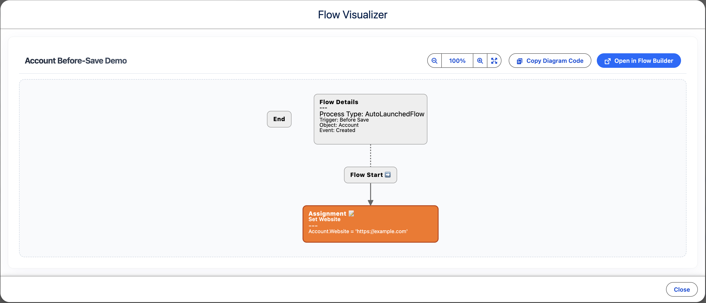
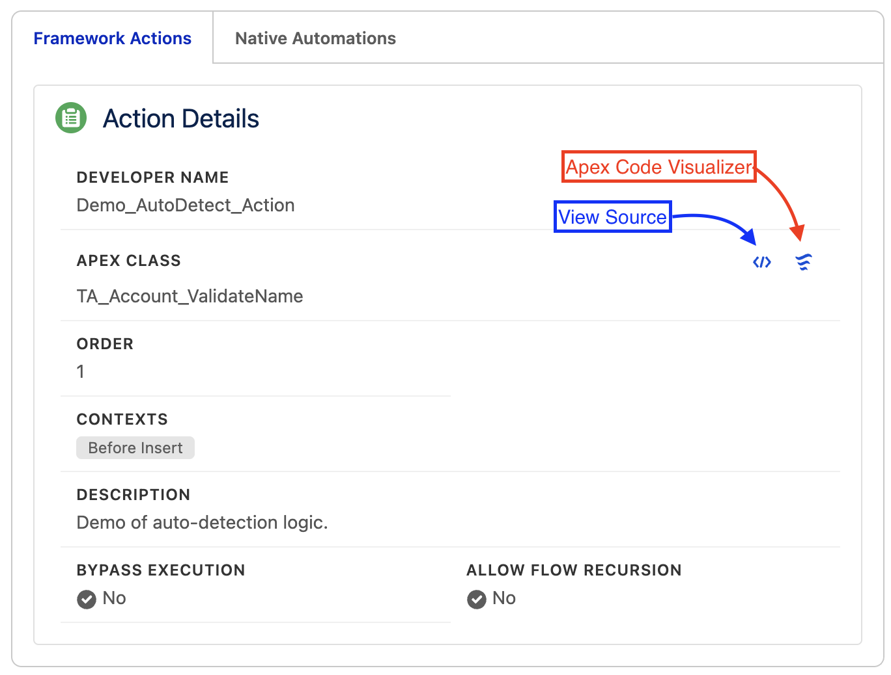
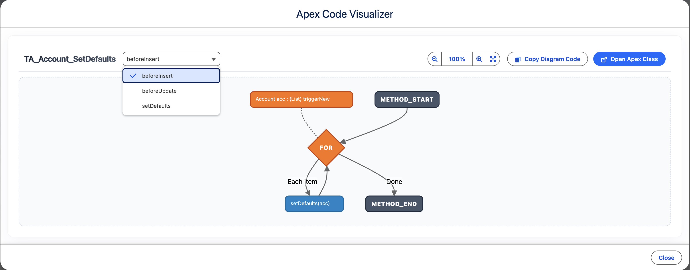
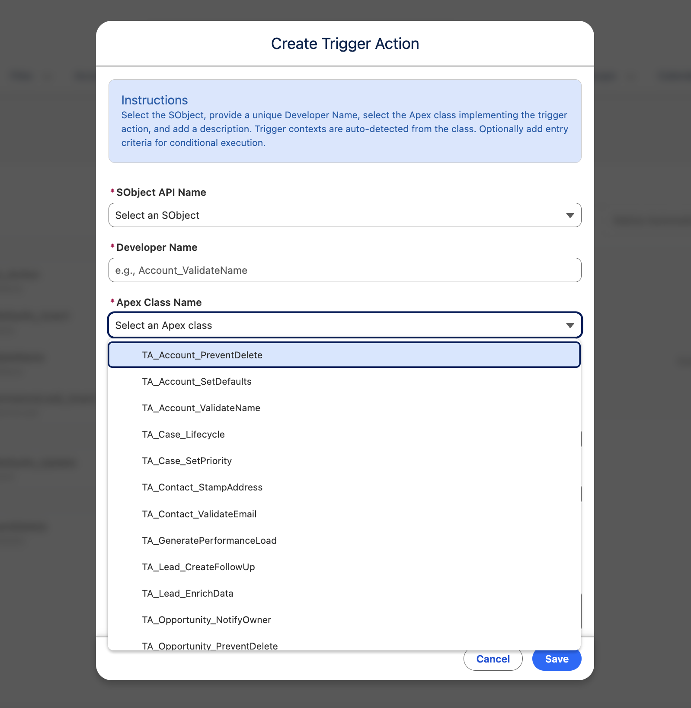
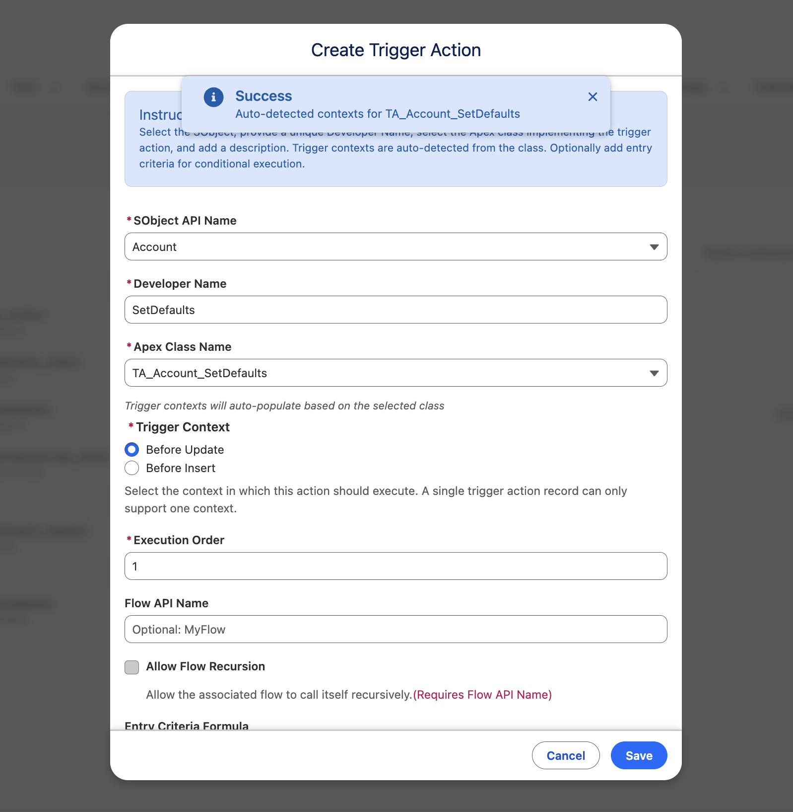

# Automation Command Center

A centralized UI for managing and visualizing Salesforce automation — built on the [Trigger Actions Framework](https://www.mitchspano.com/trigger-actions-framework). The Command Center gives administrators and developers a single pane of glass to visualize, organize, and configure automation logic directly in Salesforce, automating the underlying Custom Metadata deployments.

---

## 🚀 Installation

> [!IMPORTANT]
> **Prerequisite:** You must have the core [Trigger Actions Framework](https://github.com/mitchspano/trigger-actions-framework) installed in your org first.

### Option 1: Unlocked Package (Recommended)

- [Install in Production / Developer Org](https://login.salesforce.com/packaging/installPackage.apexp?p0=04tgL000000GmtVQAS)
- [Install in Sandbox](https://test.salesforce.com/packaging/installPackage.apexp?p0=04tgL000000GmtVQAS)

### Option 2: Deploy from Source

---

## ⚙️ Post-Installation Setup

1. Assign the **Trigger Actions Framework Admin** permission set:
   - Go to **Setup → Users → Permission Sets**.
   - Select **Trigger Actions Framework Admin**.
   - Click **Manage Assignments** and assign to your user(s).

2. Add the **Command Center** tab to any Lightning app of your choice:
   - Go to **Setup → App Manager**.
   - Edit your preferred app → **Navigation Items** → add **Command Center**.

---

## ✨ Features

### Automation Command Center

Your strategic entry point for automation governance. Get a centralized overview of framework adoption across every SObject, launch discovery scans, and initialize new SObject configurations — all from a single dashboard.

### Intelligent Discovery & Onboarding

Uncover hidden automation debt in seconds. The Discovery engine scans your entire org for unmanaged Apex Triggers and Record-Triggered Flows, identifying exactly where native logic exists and providing a streamlined path to bring it under the framework's control.

### Unified Hierarchy View

Full visibility into every automation on an object. Actions are grouped by execution context — Before Insert, After Update, etc. — and displayed in their precise execution order. Native triggers and Record-Triggered Flows are tracked alongside framework actions, with direct access to View Source and Flow Visualizer from each item.

### Flow Visualizer

Visualize Record-Triggered Flows as interactive flowcharts directly in the Command Center. See flow details, assignments, decisions, and loops rendered as a diagram — with a direct link to open the Flow in Flow Builder.

### Developer Source View

Inspect implementation logic without leaving the UI. The "View Source" feature renders Apex code for both framework-managed actions and native triggers, while the "Apex Code Visualizer" generates interactive flowcharts from your Apex classes — bridging administration and development in one place.

### Smart Action Builder

Browse only the Apex classes that implement Trigger Action interfaces. On selection, the tool auto-detects and maps supported trigger interfaces directly to your configuration — no guesswork required.

### Operational Controls

Instantly toggle bypasses for data loads or maintenance windows with immediate visual feedback. The active/disabled state of each action is visible at a glance, enabling real-time control over org-wide automations.

---

## 📖 Framework Documentation

For detailed documentation on the Trigger Actions Framework — writing Action classes, bypass logic, advanced patterns — visit the [official documentation site](https://www.mitchspano.com/trigger-actions-framework) or the [GitHub repository](https://github.com/mitchspano/trigger-actions-framework).

---

## 📝 Important Notes

- **Metadata Deployments**: Saving changes triggers a background metadata deployment. Changes typically take 5-10 seconds to reflect in the UI.
- **Deletion**: For security and stability, the Command Center does not support deleting records. Use Salesforce Setup (Custom Metadata Types) or VS Code to remove configuration records.

---

## 📋 Changelog

### v3.0.0

- **Renamed** from "Trigger Actions Admin Panel" to **Automation Command Center**
- **Removed** the dedicated Lightning app — the Command Center is now a standalone tab that can be added to any app
- **Added** Flow Visualizer — interactive flowchart rendering of Record-Triggered Flows
- **Added** Apex Visualizer — AST-powered source code visualization for Apex classes
- **Updated** framework documentation links to the [official doc site](https://www.mitchspano.com/trigger-actions-framework)

### v2.0.0

- Introduced the Command Center dashboard with org-wide automation overview
- Added Discovery engine for scanning unmanaged triggers and flows
- Added native trigger and Record-Triggered Flow tracking alongside framework actions
- Added one-click SObject initialization

### v1.0.0

- Initial release with hierarchy view, action creation, bypass toggles, and source view

---

## ☕ Support

If this project helps you, please consider supporting its development:

---

## 🤝 Contributing

Contributions are welcome! Please feel free to open issues or submit pull requests.
